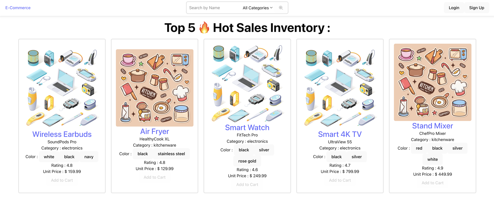

# e-Commerce Website

This is the demonstration of <b>e-Commerce Website Full Stack Web Application with Spring Boot</b>

Video Demonstration : - 

## Table of Contents

- Background
- Tech Stack & Features
- Version
- Assumption
- Quick Start

## Background

This is a full stack web application demonstration built with React, TypeScript, Tailwind CSS, PostgreSQL, Java Framework Spring Boot and so on. Buyer is able to add desired inventory to the cart and make order. Also, buyer is able to view the order's status. The seller is able to confirm and update the order status with the buyer.

### Main Page

### Inventory Search Page

### My Cart

### Pending Order

### Historical Order

### Seller's View

### Inventory Detail Page

Images source : FreePik, https://www.freepik.com/

## Tech Stack & Features

1. React
2. TypeScript
3. PostgreSQL
4. Tailwind CSS
5. Spring Boot 
6. JWT by Spring Security

## Version

1. PostgreSQL - 17
2. TypeScript - 5.7.3
3. React - 19.0.0
4. Tailwind - 4.0
5. Spring Boot - 3.4.4

### Assumption

- The payment is made before order could be made successfully.

## Quick Start

Make sure you have the following installed on your machine:
- NodeJS
- npm (Node Package Manager)
- Java
- Spring Boot
- PostgreSQL

### Cloning the Repository
> git clone git@github.com:YeonTHY95/ecommercejava.git
>
> cd ecommercejava

### Installation

Install the project dependencies for frontend using npm:

> cd frontend
>
> cd eCommerceWebsite
>
> npm install
>
> npm run dev

For backend, use any Java IDE of your choice like Eclipse or IntelliJ IDEA

### Seeding Database

To populate database with file named **data.sql** under folder resources 

Remember to configure the parameter in **application.properties** under folder resources as shown below :

> spring.sql.init.mode=always

The seller's username is **FirstSeller** with password **test** (in plain text without encryption).

### Running the Project

Run the Java Application on IDE of your choice for backend service.

Open http://localhost:5173/ in your browser to view the project. Make sure PostgreSQL is up and running

